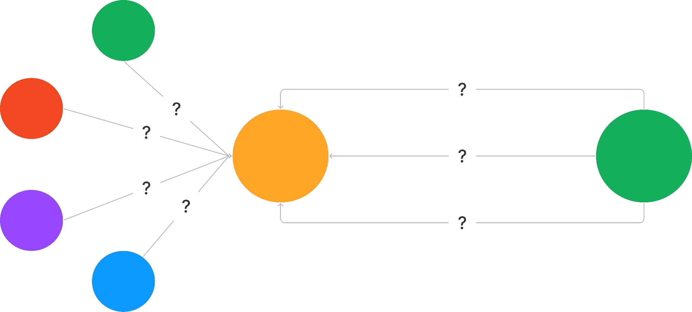

## Arquitetura de Software

### O que é Arquitetura de Software?

- É a estrutura fundamental de um sistema de software, que compreende seus componentes, as relações entre eles, e os princípios e diretrizes que governam seu design e evolução ao longo do tempo.

### Principais elementos

- **Componentes:** São as partes funcionais do sistema, como módulos, classes, funções ou serviços. Cada componente é responsável por uma funcionalidade específica.
- **Princípios e Diretrizes:** Regras e boas práticas que orientam as decisões de design e garantem que o sistema atenda aos requisitos funcionais e não funcionais.
- **Conexões:** Definem como os componentes se comunicam e interagem entre si. Isso pode incluir chamadas de métodos, troca de mensagens, acesso a bancos de dados, etc.

### Padrões Arquiteturais

- **Monolítica:** Toda a funcionalidade do sistema é implementada em um único bloco de código. Simples de desenvolver, mas difícil de escalar e manter à medida que cresce.
- **Cliente-Servidor:** Divide o sistema em clientes (interface do usuário) e servidores (lógica de negócios e dados). Facilita a distribuição de tarefas e a segurança.
- **Três Camadas:** Organiza o sistema em três camadas: apresentação, lógica de negócios e dados. Promove a escalabilidade e a separação de responsabilidades.
- **Microsserviços:** Divide o sistema em pequenos serviços independentes, cada um responsável por uma funcionalidade específica. Oferece escalabilidade granular e flexibilidade tecnológica.
- **Orientada a Serviços (SOA):** Organiza a funcionalidade do software como serviços distintos e reutilizáveis. Foca na reusabilidade e interoperabilidade.

## Padrões de Projeto

- São soluções típicas para problemas comuns em projetos de software.

Exemplos:

1. Quando você precisa garantir que apenas uma instância de uma classe seja
criada e que ela seja acessível globalmente;
2. Quando você precisa notificar objetos sobre mudanças em outro objeto, sem
que eles estejam fortemente acoplados;
3. Quando você precisa adicionar funcionalidades a um objeto sem modificar
sua classe.
4. Etc…
- De forma geral, podemos definir da seguinte maneira: Padrões de Projeto são soluções reutilizáveis de software orientado a objetos.

### Elementos essenciais

- O Propósito do padrão descreve brevemente o problema e a solução.
- A Motivação explica a fundo o problema e a solução que o padrão torna possível.
- As Estruturas de classes mostram cada parte do padrão e como se relacionam.
- Exemplos de código em uma das linguagens de programação populares tornam mais fácil compreender a ideia por trás do padrão.

### Classificação dos padrões

- Podem ser caracterizados por seu propósito ou intenção
- **Criacionais**, fornecem mecanismos de criação de objetos que aumentam a flexibilidade e a
reutilização de código. (Factory Method, Abstract Factory e Builder)
- **Comportamentais**, cuidam da comunicação eficiente e da assinalação de responsabilidades entre objetos. (Chain of Responsibility, Command e Interpreter)
- **Estruturais**, explicam como montar objetos e classes em estruturas maiores, enquanto ainda
mantém as estruturas flexíveis e eficientes. (Adpter, Bridge, Composite)

## Padrões de Projetos Criacionais

- Os padrões criacionais são um tipo de padrão em que se concentram em abstrair e simplificar a criação de objetos. Eles ajudam a controlar o processo de instanciação de objetos de uma maneira que o código fique mais flexível e fácil de manter. Em vez de criar objetos diretamente, os padrões criacionais fornecem métodos ou mecanismos para criar instâncias de classes, permitindo maior controle sobre o processo de criação.

### Factory Method

- O padrão Factory Method define uma interface para criar um objeto, mas permite que as subclasses possam decidir qual classe instanciar, possibilitando que uma superclasse seja capaz de prorrogar a instanciação de uma classe para as subclasses.

### Exemplo

Você está criando um módulo para geração de boletos em sua aplicação.

- Esses boletos são de um banco específico.
- Diferentes taxas e cálculos para cada tipo de boleto.
- Vencimento 10 dias, Juros 2% Desconto 10% Multa 5%
- Vencimento 30 dias, Juros 5% Desconto 5% Multa 10%
- Vencimento 60 dias, Juros 10% Desconto 0% Multa 20%

### **Evolução do Código**

Devemos evoluir nosso módulo para aceitar a geração de boletos de um novo banco.

- Diferentes taxas e cálculos para cada tipo de boleto.
- Vencimento 10 dias, Juros 3% Desconto 5% Multa 2%
- Vencimento 30 dias, Juros 5% Desconto 2% Multa 5%
- Vencimento 60 dias, Juros 10% Desconto 0% Multa 15%

### Aplicabilidade

Quando uma classe não sabe antecipar qual tipo de objeto deve criar, ou seja, entre várias classes possíveis não é possível prever qual delas deve ser utilizada.

- Quando se precisa que uma classe delegue para suas subclasses as especificações dos objetos que instanciam.
- Quando classes delegam responsabilidade a uma dentre várias subclasses auxiliares, se deseja manter o conhecimento nelas e ainda saber qual subclasse foi utilizada em determinado contexto.

### Consequências

- O padrão Factory Method elimina o forte acoplamento entre classes concretas.
- Criar objetos dentro de uma classe com um método factoryMethod() é sempre mais
flexível do que criar um objeto diretamente.
- Os clientes podem achar os métodos de fábrica úteis, e os utilizar diretamente.

Link do Código: [hSttps://github.com/paeeglee/unisatc-design_patterns/tree/factory-method/aula-3/factory_method](https://github.com/paeeglee/unisatc-design_patterns/tree/factory-method/aula-3/factory_method)

- De acordo com a análise do exemplo, ficou entendido que: Eu tenho o objetivo de gerar um boleto (classe principal - interface de criação do objeto boleto) e posso ter vários clientes (diferentes tipos de bancos) onde implementam essa instância de gerar boleto, contudo, cada banco possui, juros, descontos e multas diferentes. Assim sendo, eu vou ter o bancoCaixa que faz um extends do Banco que implementa o objeto de gerar boleto, dessa forma, quando eu for gerar um boleto, eu deixo o bancoCaixa decidir de acordo com a solicitação (parâmetro passado no momento que chama) se ele implementa criação de um boleto de 10, 30 ou 60 dias, tendo em mente que cada boleto possui juros, descontos e multas diferentes.

### Abstract Method

O padrão Abstract Factory fornece uma interface para criar famílias de objetos relacionados ou dependentes sem especificar suas classes concretas.

### Exemplo

- Você está criando um módulo para geração de boletos em sua aplicação.
- Diferentes taxas e cálculos para cada banco.
- Caixa Juros 2% Desconto 10% Multa 5%
- BB, Juros 3% Desconto 5% Multa 2%

- De acordo com a análise do código de exemplo disponibilizado pelo professor, temos uma classe abstrata que é o “Boleto” e 4 interfaces com responsabilidades diferentes:
    - Desconto > Responsável pelo get do desconto
    - Multa > Responsável pelo get da multa
    - Juros > Responsável pelo get do juros
    - Calculo Factory > Responsável pelos métodos de criar Juros, Multa e Desconto
- Logo, minha classe concreta banco caixa, deve implementar essas interfaces, retornando seus valores para a formação do boleto:
    - CaixaCalculoFactory > Implementa a interface Calculo Factory para realizar os cálculos do boleto
    - CaixaDesconto > Implementa a interface desconto que deve retornar o desconto sobre o boleto
    - CaixaJuros > Implementa a interface juros que deve retornar o juros decorridos sobre o boleto
    - CaixaMulta > Implementa a interface jutos que deve retornar a multa decorrida sobre o boleto
- Por fim, minha classe abstrata boleto deve receber o bancoFactory e o valor do boleto, onde a partir do boleto gerado posso acessar os métodos de cálculos que foram implementados na minha classe concreta do banco a partir da interface CalculoFactory.

### Aplicabilidade

- Quando um sistema deve ser independente de como seus produtos são
criados, compostos ou representados.
- Quando um sistema deve ser configurado com uma dentre múltiplas famílias
de produtos.
- Quando uma família de objetos relacionados foi projetada para ser usada em
conjunto e é necessário impor essa restrição.
- Quando se deseja fornecer uma biblioteca de produtos e se deseja revelar
para o cliente apenas suas interfaces e não suas implementações.

### Consequências

- Promove o isolamento de classes concretas.
- Facilita a troca de famílias de produtos.
- Promove a consistência entre produtos.
- Suportar novos tipos de produtos é difícil.
- Criar novos produtos de um tipo já existente é fácil.

### **Builder**

O padrão Builder separa a construção de um objeto complexo de sua representação de modo que o mesmo processo de construção de um objeto possa criar diferentes representações.

- De acordo com o exemplo disponibilizado pelo professor, temos apenas uma interface que é a responsável pela implementação do builder:
    - BuilderGeradorPDF > Retorna o get do gerador de PDF
- Logo, o geradorDePDF é a minha classe concreta com os getters e setters das propriedades do PDF (orientação, margin, footer…). Assim sendo, possuo outros duas classes com os tipos de PDF que desejo criar > BuilderA4 e BuilderA3, onde ambas implementam minha interface do BuilderGeradorPDF que vou poder retornar o PDF depois de criado (get).
- Contudo, ainda há a implementação de um Diretor, que é responsável por direcionar a forma e qual tipo de PDF estou gerando, onde posso implementar métodos como criarGeradorPDF() e criarGeradorPDFSemHeader(), que são responsáveis por chamar o builder para fazer os setters corretos para a criação do PDF.

### Aplicabilidade

- Quando o algoritmo que cria um objeto complexo deve ser independente das
partes que o compõem e de como tais partes são montadas.
- Quando o processo de construção deve permitir representações diferentes
para o objeto que é construído.

### Consequências

- Permite variar a representação interna de um produto.
- Isola o código de construção e representação.
- Oferece um controle mais fino sobre o processo de construção.

## POO

- Classe
    - conjunto de características e comportamentos que definem o conjunto de objetos pertencentes à essa classe
- Objeto
    - criado a partir de características variadas de uma classe
- Encapsulamento
    - propriedade de “esconder” e “modificar” atributos e métodos diretamente, o que impede a possibilidade de efeitos colaterais indesejados. Ainda, vale também para métodos que implementam várias regras de negócios tornando-o “complexo”, dessa forma, estamos encapsulando isso.
- Herança
    - propriedade de uma classe herdar atributos que são comuns a classe filha. Exemplo: Classe principal: Animal > Classe filha: Cachorro. Dessa forma, a classe Cachorro herda os atributos da classe Animal.
- Interface
    - conjunto de métodos(normalmente regras) que todas as classes que “herdarem” dela devem possuir (implementar). Exemplo: Interface Automóvel possui métodos de acelerar e frear. Logo, minha classe carro deve implementar esses métodos.
- Polimorfismo
    - propriedade de implementar o mesmo método mas eles tem comportamentos diferentes, ou seja, possui várias formas de ocorrer o mesmo processo. Como por exemplo, tocar música em um carro: Bluetooth, PenDrive, Etc..
- Associação, Agregação e Composição
    - Toda agregação e composição são associações. Composição é quando o objeto "filho" não faz sentido fora do objeto "pai". Agregação é quando o objeto filho existe sem o objeto pai, mas agrega informações a ele. Um endereço existe independentemente de um funcionário morar lá ou não. Então é uma agregação. Agora em um sistema de banco, um Titular só existe se ele tiver uma conta aberta, concorda? Se não houver conta aberta, não há titular. Isso é uma composição.

## SOLID

SOLID é um acrônimo que representa cinco princípios de design de software que ajudam a criar sistemas mais flexíveis, escaláveis e fáceis de manter. Cada letra do acrônimo representa um princípio fundamental:

- **S - Single Responsibility Principle (Princípio da Responsabilidade Única)**: Este princípio estabelece que uma classe ou módulo deve ter apenas uma razão para mudar. Ou seja, uma classe deve ter apenas uma responsabilidade ou função bem definida. Isso ajuda a evitar que uma classe seja muito grande e complexa, tornando-a mais fácil de entender e manter.
- **O - Open-Closed Principle (Princípio Aberto-Fechado)**: Este princípio estabelece que uma classe ou módulo deve ser aberto para extensão, mas fechado para modificação. Isso significa que você deve ser capaz de adicionar novas funcionalidades a uma classe sem precisar modificar seu código existente. Isso ajuda a manter a estabilidade do sistema e a evitar que mudanças em uma classe afetem outras partes do sistema.
- **L - Liskov Substitution Principle (Princípio de Substituição de Liskov)**: Este princípio estabelece que objetos de uma classe derivada devem ser substituíveis por objetos de sua classe base. Isso significa que uma classe derivada deve ser capaz de ser usada como se fosse uma instância da classe base, sem que o código que a utiliza precise saber a diferença. Isso ajuda a garantir que as classes derivadas sejam compatíveis com as classes base.
- **I - Interface Segregation Principle (Princípio de Segregação de Interface)**: Este princípio estabelece que uma classe não deve ser forçada a implementar interfaces que não são relevantes para ela. Em vez disso, as interfaces devem ser divididas em interfaces menores e mais específicas, que podem ser implementadas por classes que as necessitem. Isso ajuda a evitar que as classes sejam forçadas a implementar métodos que não são necessários.
- **D - Dependency Inversion Principle (Princípio de Inversão de Dependência)**: Este princípio estabelece que as classes de alto nível não devem depender de classes de baixo nível, mas sim que ambas devem depender de abstrações. Isso significa que as classes devem ser projetadas para depender de interfaces ou abstrações, em vez de depender de implementações específicas. Isso ajuda a reduzir a dependência entre as classes e a tornar o sistema mais flexível e escalável.

---
---
---

# Prova 2

# Adapter - Design Patterns

## Definição

O padrão **Adapter** converte a interface de uma classe para outra interface que o cliente espera encontrar. Ele permite que classes com interfaces incompatíveis trabalhem juntas.

## Estrutura

O padrão pode ser implementado em dois formatos:
- **Adapter de classe**: utiliza herança para adaptar a interface.
- **Adapter de objeto**: usa composição, onde o adaptador contém a instância da classe que precisa ser adaptada.

## Aplicabilidade

Este padrão é aplicável quando:
- É necessário usar uma classe existente, mas sua interface é diferente da esperada.
- Deseja-se criar uma classe reutilizável que coopere com classes que não possuem interfaces compatíveis.
- É impraticável adaptar várias subclasses existentes através de herança, sendo mais eficiente utilizar um adaptador de objeto.

## Consequências

As principais consequências do padrão Adapter são:
- A quantidade de trabalho que o Adapter realiza depende da semelhança entre a interface alvo e a classe adaptada.
- O Adapter torna classes mais reutilizáveis, eliminando suposições que outras classes poderiam fazer sobre suas interfaces.

# Aula - Padrão de Projeto Bridge

## Definição
O padrão **Bridge** desacopla uma abstração de sua implementação, permitindo dividir uma classe grande ou um conjunto de classes interligadas em duas hierarquias separadas. Assim, essas hierarquias podem variar de forma independente.

## Aplicabilidade
- Quando se deseja evitar uma ligação permanente entre uma abstração e sua implementação.
- Quando abstrações e implementações precisam ser extensíveis por meio de subclassificação.
- Quando há proliferação de classes.

## Consequências
- **Desacoplamento** da interface e da implementação.
- Maior **extensibilidade**.
- Oculta os detalhes da implementação dos clientes.

# Aula Composite

## Design Patterns (Padrões de Projeto)

### Composite

#### Definição
O padrão Composite permite a composição de objetos em estruturas de árvore para representar hierarquias parte-todo. Os clientes podem tratar objetos individuais ou composições de objetos de maneira transparente e uniforme.

#### Estruturas
- **Pasta**
  - Nome
  - Caminho
  - Pode ser exibida
  - Pode ter filhos adicionados
  - Pode ter filhos removidos
  - Pode ter filhos recuperados

- **Arquivo**
  - Nome
  - Caminho
  - Pode ser exibido

  

### Aplicabilidade
- Representar uma hierarquia de objetos.
- Permitir que clientes ignorem a diferença entre composições de objetos e objetos individuais.

### Consequências
- Definição de hierarquias de classes com objetos primitivos (folhas) e objetos compostos (nós).
- Tratamento uniforme de estruturas compostas e objetos individuais pelos clientes.
- Facilidade na adição de novos tipos de componentes.
- Possível excessiva generalização na arquitetura do código.

# Chain of Responsibility - Design Patterns

## Definição

O padrão **Chain of Responsibility** evita o acoplamento do remetente de uma solicitação ao seu receptor, 
dando a mais de um objeto a oportunidade de tratar a solicitação. Ele encadeia os objetos receptores, 
passando a solicitação ao longo da cadeia até que um objeto a trate.

## Estrutura

O padrão pode ser entendido da seguinte maneira:
- **if-else if-else**: verificações em sequência
- **switch-case**: casos que são tratados conforme a condição
- Encadeamento de objetos responsáveis por tratar as solicitações.

## Aplicabilidade

Este padrão é aplicável em situações como:
- Quando mais de um objeto pode tratar uma solicitação e não se sabe qual deles irá realizar o tratamento.
- Quando é necessário enviar uma solicitação para um dos vários objetos sem especificar explicitamente qual.
- Quando o conjunto de objetos que pode tratar uma solicitação precisa ser especificado dinamicamente.

## Consequências

Entre as principais consequências do uso do padrão, temos:
- Redução de acoplamento entre o remetente e o receptor da solicitação.
- Maior flexibilidade na atribuição de responsabilidades aos objetos.
- A resposta à solicitação não é garantida, podendo passar por todos os objetos sem ser tratada.

# Observer - Design Patterns

## Definição

O padrão **Observer** define uma dependência um-para-muitos entre objetos, de modo que, quando um objeto muda seu estado, todos os seus dependentes são notificados e atualizados automaticamente.

## Estrutura

O padrão pode ser utilizado em duas políticas:
- **Política pull**: os objetos dependentes (observadores) perguntam sobre as atualizações do objeto observado.
- **Política push**: o objeto observado informa os observadores sobre as atualizações de forma proativa.

## Aplicabilidade

Este padrão é aplicável quando:
- Há dois aspectos de uma abstração que dependem um do outro, e é necessário que possam variar e ser reutilizados independentemente.
- Quando uma alteração em um objeto requer a alteração de outros, e não se sabe quantos objetos precisarão ser alterados.
- Quando um objeto precisa notificar outros objetos sem conhecê-los, mantendo o desacoplamento.

## Consequências

As principais consequências do padrão Observer são:
- Permite variar e reutilizar assuntos e observadores de forma independente.
- Cria um acoplamento abstrato entre o objeto principal (assunto) e os observadores.
- Suporta comunicação via broadcast.
- Pode causar atualizações inesperadas ou cíclicas.

# State - Design Patterns

## Definição

O padrão **State** permite que um objeto altere seu comportamento quando seu estado interno muda, fazendo com que pareça que a classe do objeto mudou.

## Estrutura

O padrão envolve dois componentes principais:
- **Context**: mantém uma referência para o estado atual do objeto e delega as operações ao estado.
- **State**: define a interface para o comportamento associado a um estado específico do Context.

## Aplicabilidade

Este padrão é aplicável quando:
- O comportamento de um objeto depende de seu estado e ele precisa alterar seu comportamento durante a execução.
- As operações possuem muitas condições dependentes de estado que podem ser expressas usando subclasses de estados.

## Consequências

As principais consequências do padrão State são:
- Organiza melhor o código ao dividir os comportamentos em estados distintos.
- Torna as transições de estados explícitas.
- Pode aumentar o número de classes no sistema, pois cada estado é uma classe separada.
