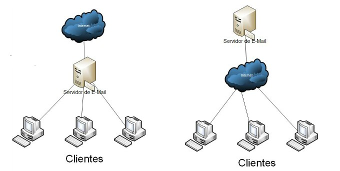

# Redes e computadores

Um resumo sobre redes e computadores

## História
-   Ano 1978: Criação de TCP/IP
- Ano 1983: Obrigatoriedade do TCP/IP

Segundo Soares, Lemos e Colcher(1995): "Uma rede de computadores se define por um conjunto de dispositivos capazes de efetuar qualquer tipo de troca de mensagens através de um meio de transmissão";

## Composição

- Intranet: Áreas, células e departamentos;
- Extranet: Parceiros, filiais e clientes;
- Internet: Público consumidor;

## Classificação

### Quanto à abrangência *:

 São representados pelo número de dispositivos processadores, organizados em um tamanho físico.

- Lan (Local Area Network): Redes locais que cobrem uma área geograficamente limitada, como um escritório, uma escola ou um edifício. Normalmente, utilizam Ethernet ou Wi-Fi.

- CAN (Campus Area Network): Redes que conectam múltiplas LANs dentro de uma universidade, empresa ou campus industrial. Duas ou mais LAN's

- MAN (Metropolitan Area Network): Redes que cobrem uma cidade ou uma grande área urbana, conectando várias LANs dentro de uma região metropolitana. Usada por grandes corporações ou governos. Necessita de um ISP (internet service provider)

- WAN (Wide Area Network): Redes que cobrem grandes áreas geográficas, como países ou continentes. A internet é o maior exemplo de WAN. Global area network.

### Quanto ao modelo computacional ou por serviço: 

- Centralizado : Processamento central com um computador de alta capacidade. Acesso por meio de terminais burros.

- Distribuída: Cada dispositivo possui sua capacidade de processamento. Exemplos: Cliente/Servidor, ponto-a-ponto, baseado em servidor e front-end/back-end.

- Cooperativa: Vários dispositivos
processadores para
completar uma
determinada tarefa.

### Quanto ao tipo de comutação:

- Circuito: Sempre o mesmo caminho, orientado à conexão e determinístico.

- Pacotes: Fragmentação, pacotes, datagramas, quadros, células, mensagens e de acordo com a camada.

### Quanto a topologia *: 

Refere-se a maneira como os dispositivos processadores de uma rede estão conectados.

- Mesh (totalmente conectado): Totalmente redundante, mas com alto custo.

- Anel: Dispositivos interconectados, baixo custo de infra, mas se um dispositivo para, toda a rede para.

- Barramento: Elemento central, utiliza-se de um hub e usa cabeamento coaxial.

- Estrela: Usa um switch como concentrador e é usada em redes ethernet com cabeamento estruturado.

## Transmissão de dados

### Tipos

- Transmissão Simplex: Comunicação unidirecional onde os dados fluem em apenas uma direção.

- Transmissão Half-Duplex: Comunicação bidirecional, mas não simultânea. Os dados podem fluir em ambas as direções, mas apenas uma direção por vez. Ex: hub.

- Transmissão Full-Duplex: Comunicação bidirecional simultânea. Os dados podem fluir em ambas as direções ao mesmo tempo. Ex: switch.

### Analógica x Digital

No mundo real as informações são analógicas, podem assumir qualquer valor ao longo do tempo.

Os computadores sçao digitais por causa das interferências no sistema analógico, com valores de 0 e 1

### Correção de erros

Cada pacote transmitido na rede contém um código de verificação, checksum, que é a soma de todas as informações do pacote.

### Uso de canal

- Banda base: É usado apenas um canal e com sinal digital.

- Banda larga: É usado em multiplos canais e com sinal analógico.

### Medidas de desempenho

- Throughput: Taxa de transmissão prática da rede.

- Delay: tempo que o pacote demora para chegar ao destino.

- Atraso médio: soma do atraso de todos os pacotes dividido pelo número de pacotes.

- Jitter: desvio padrão referente ao atraso.

- RTT (Roud trip time): tempo de viagem ida e volta.

## Fundamentos

TCP/IP não é apenas um protocolo, e sim um conjunto de protocolos, também chamado de pilha de protocolos. Ex: HTTP -> TCP -> IP.

O modelo TCP/IP, também conhecido como o modelo de Internet, é uma simplificação do modelo OSI. Ele possui quatro camadas (Aplicação, Transporte, Internet, e  Rede)*.

O protocolo IP (Internet Protocol) é responsável por endereçar e rotear pacotes de dados entre dispositivos em redes diferentes *.

- Diferença entre IP e MAC *:
    - Endereçamento IP: É um endereço lógico atribuído a um dispositivo em uma rede para identificar sua localização na rede, permitindo a comunicação entre dispositivos em diferentes redes.

    - Endereçamento MAC: É um endereço físico único atribuído à interface de rede de um dispositivo. O endereço MAC é usado para comunicação dentro da mesma rede local.

- Diferença entre endereço IP público e privado *:
    - IP Público: É um endereço IP que pode ser acessado diretamente pela internet e é único em todo o mundo. Ele é usado para identificar dispositivos na internet.

    - IP Privado: É um endereço IP usado dentro de uma rede local e não pode ser acessado diretamente pela internet.

- Conceito de DNS *:
    - O DNS (Domain Name System) é um sistema que traduz nomes de domínio legíveis por humanos (como www.example.com) em endereços IP numéricos que são usados pelos dispositivos para localizar e comunicar-se com outros dispositivos na rede.

## Modelo OSI

No surgimento das redes, elas eram proprietárias. Para facilitar isso foi cirado um padrão pela ISO, chamado de OSI(Operation Systems Interconnection). 

- É um modelo de 7 camadas.

- Teoricamente cada camada
é de responsabilidade de
um protocolo: por isso pilha
de protocolos;

- Na prática, a maioria das
pilhas não segue a risca o
modelo, implementa muitas
vezes o mesmo protocolo
para duas camadas;

- Para o entendimento do
funcionamento da rede faz-
se necessário o estudo do
OSI;

- Na prática, o cliente HTTP se comunica diretamente
com o servidor Web;

- Ignora-se que ocorra a comunicação do protocolo
HTTP com o TCP, e após com o IP, e após com o
Ethernet, que envia o quadro pela rede, onde a
mesma o transmite. No outro lado o processo inverso;

- As camadas do Modelo OSI são divididas em três
grupos:
    - Aplicação: transforma o dado em compreensível pela
    aplicação;

    - Transporte: faz a ponte entre a rede e a aplicação *;

    - Rede: se preocupa com a transmissão e recepção dos
    dados.

### Aplicação

Faz a interface entre
a pilha de protocolos
e o aplicativo que
pediu ou receberá
informações da rede.
Exemplo: HTTP, FTP,
NFS, entre outros;

- Três protocolos de aplicação e suas respectivas funções *: 
    - HTTP (Hypertext Transfer Protocol): Usado para transferir documentos da web (como páginas HTML) na internet.

    - FTP (File Transfer Protocol): Utilizado para a transferência de arquivos entre um cliente e um servidor.

    - SMTP (Simple Mail Transfer Protocol): Usado para o envio de e-mails entre servidores de correio eletrônico.

- Diferença entre HTTP e HTTPS *:
    - O HTTPS (Hypertext Transfer Protocol Secure) é a versão segura do HTTP. Enquanto o HTTP transmite dados em texto claro, o HTTPS utiliza criptografia SSL/TLS para proteger a integridade e confidencialidade dos dados transmitidos.

### Apresentação

- Também chamada de
Tradução, converte o
formato do dado recebido
pela aplicação em um
formato comum a ser
usado na transmissão
desse dado. 

- Nessa camada ocorre
tarefas como compressão
dos dados e criptografia; 

- Exemplo: SSL (Secure
Socket Layer);

### Sessão

- Os computadores
estabelecem uma sessão de
comunicação. Nesta seção é
definida como será feito a
transmissão de dados; 

- Caso a rede falhe, a
transmissão continua de
onde parou; 

- Na prática, as pilhas
implementam esta camada
usando um protocolo
separado.

### Transporte

- Responsável por pegar os
dados e dividi-los em
pacotes *;

- No receptor ocorre a
montagem;

- Essa camada sabe qual o
protocolo da camada de
sessão;

- Controle de Fluxo;

- Verificação de Erros (ACK);

- Perda e duplicação de
pacotes;

- Diferenças entre TCP e UDP *:
    - Confiabilidade: O TCP (Transmission Control Protocol) é um protocolo orientado à conexão, garantindo a entrega dos pacotes na ordem correta e com confirmação de recebimento. Já o UDP (User Datagram Protocol) é não orientado à conexão e não garante a entrega ou a ordem dos pacotes.
    
    - Controle de Fluxo: O TCP possui mecanismos de controle de fluxo e congestão para ajustar a taxa de transmissão de dados, enquanto o UDP não tem controle de fluxo, sendo mais rápido, mas menos confiável.

- Ex.: TCP e UDP;

### Rede

- Responsável pelo
endereçamento
lógico dos pacotes;

- Tradução de
endereços lógicos
em físicos (MAC);

- Independente de
arquitetura;

### Enlace de Dados

- Pega os pacotes recebidos
e transforma em quadros *;

- Adiciona:
    - Endereço MAC (O e D);

    - Controle;

    - Dados;
    
    - Checksum (Orientado - ACK);

- Verifica o meio;

- Controlado por Hardware;

- Exemplos: Ethernet, Switch.

- LLC (802.2) e MAC (802.3);

### Física

- Transforma os
quadros em sinais
compatíveis com o
meio físico;

- Padrões:
    - 10BaseT

    - 100BaseT

    - 100BaseFx

    - 1000BaseT

    - 10GBaseT

### Protocolos de Roteamento

- RIP: Routing Information Protocol, tabela de rota a cada 30s, caminho mais curto(menos saltos), nem
sempre o melhor. Envia tabela de roteamento inteira aumentando tráfego de rede. Porta 520 UDP;

- OSPF: Open Shortest Path First, caminho mais rápido e não mais curto. Manda hello aos roteadores
que tem acesso, assim sabe qual esta operacional e o seu estado. OSPF permite balanceamento de
carga, dividindo datagramas entre rotas. Não usa portocolo TCP ou UDP é direto na camada Internet
com protocolo IP;

- BGP: Usado por roteadores da internet. Classificado como protocolo externo, diferente de RIP e OSPF.
Envia apenas o que há de novo em suas tabelas de roteamento. Verifica de tempos em tempos se um
caminho esta acessível ou não. Porta 179 TCP.

## Ethernet

- Mais usada em redes locais;

- Camadas 1 e 2 do OSI;

- Função de pegar os dados entregue pelos
protocolos de alto nível e inseri-los dentro
dos quadros que serão enviados através
da rede.

- Define como os dados serão transmitidos
fisicamente;

- Duas camadas: LLC e MAC;

### LLC

Controle de Link
Lógico (IEEE 802.2):
inclui informações de
protocolo de alto nível,
operando na camada
dois do Modelo OSI.
Com isso, a máquina
receptora tem como
saber qual o protocolo
de alto nível deve-se
entregar os dados de
um quadro que ele
acabou de receber.

### MAC

Media Access
Control (IEEE 802.3):
monta o quadro de
dados a ser transmitido
pela camada física,
incluindo cabeçalhos
próprios dessa camada
aos dados recebidos da
camada de LLC. Verifica
ainda se o meio físico
está pronto para ser
usado (CSMA/CD, entre
outros).

### PHY

Physical:
transmite os quadros
entregues pela
camada MAC. Define
como os dados são
transmitidos através
do meio físico e
também o formato
dos conectores
usados pela placa de
rede.

### CSMA/CD 

Carrier
Sense Multiple
Access With
Collision Dectect
(Hub): Acesso
Múltiplo para
detecção de
portadora com
Detecção de
Colisão;

Enquanto um hub apenas conecta vários dispositivos ethernet em um único segmento, o switch é mais inteligente, permite endereça individualmente o tráfego e permite dividir o tráfego em várias VLANs *.

### Unicast

### Multicast

### Broadcast

### Mac address

- Gravado na ROM da Plcaca de
Rede;

- MAC Broadcast: FF-FF-FF-FF-FF-FF;

- Têm 48 bits expressos em
hexadecimal;

- Os 3 primeiros octetos(24 bits)
identificam o fabricante (OUI) e os
3 últimos(24 bits) a placa de rede
propriamente dita.

### Network Interface Card (NIC)

- Papel principal é
receber quadros
enviados pela Camada
MAC, e transmitir
através do meio físico;

## Arquitetura wifi

### Ad-hoc

- Conecta um número
pequeno de hosts;

- Não possui um WAP (conjunto de protocolos de comunicação para aparelhos sem fio);

- Compartilhamento
de Redes (Bridge);

- É responsável pela
codificação dos sinais;

### BSS (Basic Service Set)

- Utiliza um WAP;

- Possui um SSID
(Service Set
Identification);

- BSSID: MAC do SSID;

### ESS (Extended Service Set)

- Vários AP´s (dispositivo de rede que liga redes com e sem fios) com o
mesmo SSID;

- 10% da área do
próximo;

- Serviços às
Estações:
    - Autenticação: permitir ou impedir acessos;

    - Desautenticação: quando um estação
pretende se desconectar da rede sem fio;

    - Privacidade: WEP, WPA, WPA2, WPA-
Enterprise, outros;

    - Entrega de dados: enviar os dados de um
dispositivo a outro;

- Serviços do
WAP:
    - Associação: ligação entre a estação e um WAP;

    - Desassociação: pode ser feito pelo AP ou
estação;

    - Reassociação: em arquiteturas ESS, permite
roaming entre WAP;

    - Distribuição: acesso a outras estações;

    - Integração: troca de dados entre 802.11 e
802.3;

## Arquitetura token ring

- Padrão proprietário
IBM;

- Ainda utilizado em
Mainframes;

- Não existem colisões;

- Passagem de Token;

- Tamanho de quadro:
1.500 bytes contra
17.800 bytes;

## Arquitetura FDDI

- Primeira arquitetura a
utilizar fibras;

- Duas camadas físicas, uma
para codificação e outra
chamada PMD (Physical
Media Dependent) que
define conectores,
transmissores e receptores;

- Pode trabalhar com anéis
duplos;

- Várias fichas rodando pela
rede.

## Meios físicos

### Coaxial

- Obsoleto;

- Vantagens:
    - Longo Alcance;

    - Multicanal;

    - Imunidade contra ruídos e contra a atenuação;

- Desvantagens:
    - Mau contato e quebra por ser inflexível;

    - Passagem dos cabos, pouca flexibilidade *;

    - Topologia linear;

### Par trançado

- UTP (Unshielded) e S/UTP;

- STP (Shielded) e S/STP:

- O cabo STP possui blindagem, enquanto o UTP não *.

- Uso Interno;

- Cancelamento para
proteção de ruídos;

- Vantagens: 
    - Preço.

    - Flexibilidade.

    - Fácil Instalação;

- Desvantagens: 
    - Limite de Comprimento.

    - Interferência;

### Velocidade 

- Ethernet: 10BaseT;

- FasEthernet: 100BaseT;

- GigabitEthernet:
1000BaseT;

- 10GEthernet: 10GBaseT

### Cabos

No primeiro exemplo com cabo direto temos um cabo direto usando a mesma norma.

No cabo cruzado temos uma troca de norma em cada ponta.

Normas abaixo:

### Patch Panel:

- Concentrador
de Cabos *;

- Usado em
cabeamento
horizontal;

- Patch cords
para
comunicação
com
equipamentos
de rede.
    - Conecta dispositivos de rede a um patch panel *. 

### Fibra ótica

- Transmissão por meio de luz e
não elétrons;

- Vantagens:
    - Imune a interferências, mas não a todas *;

    - Dimensões reduzidas;

    - Segurança no tráfego;

    - Maiores distâncias;

    - Maior capacidade de transmissão;

    - Sinal sofre menos atenuação;

    - Inibi descargas atmosféricas;

- Desvantagem?

- Tamanhos da fibra:

- A fibra é imune a tudo?

    - Microbends pequenas deformações devido as
variações na temperatura ou no processo de
fabricação.

    

    - Macrobend são gerados durante a instalação da
fibra e faz com que parte da energia luminosa saia
do núcleo e se perca na capa.

    

    - Tamanho influencia *.

- Equipamento para medir fibra: Otdr *;

---
---
---

# Prova 2

roteador é o conhecedor da rota

dominio de colisao(switch e bridge) e broadcast(roteador)

Parametros que afetam latencia

Para a prova exercicio de colisao e broadcast

# Cabeamento Estruturado

## Definição
- **Cabeamento Estruturado**: Sistema que envolve cabos e hardware de conexão, conforme normas, projetado para atender às necessidades de telecomunicações e TI dos usuários em edifícios comerciais.

  
## Tipos de Meios de Transmissão
- **Cabo UTP**: 
  - Par trançado para reduzir interferências.

  - Classificações de flamabilidade:
    - **CMX**: Instalações residenciais.
    - **CM**: Instalações horizontais com alta ocupação.
    - **CMR (Riser)**: Instalações verticais.
    - **CMP (Plenum)**: Locais fechados.

## Normas EIA/TIA
- **EIA/TIA 568**: Define o cabeamento estruturado com quatro partes:
  - **C.0**: Cabeamento genérico.
  - **C.1**: Cabeamento para telecomunicações em edifícios comerciais.
  - **C.2**: Componentes padrão (conectores, cabos, etc.).
  - **C.3**: Componentes de fibra ótica.

  

## Cabeamento Horizontal e Vertical
- **Cabeamento Horizontal**:
  - Define os padrões de instalação de cabos e dutos dentro de edifícios.
  - **Tomadas de rede**: Devem ter largura mínima de 50mm e altura de 75mm.

- **Cabeamento Vertical**:
  - Utiliza a topologia estrela.
  - Todos os dutos devem ser protegidos contra fogo.

## Cuidados na Instalação
- Evitar torcer ou prensar cabos.
- Não expor os cabos a altas temperaturas (máximo 60°C).
- Evitar emendas em cabos UTP.

## Testes e Certificação
- **Wiremap**: Verifica a continuidade de cada fio.
- **Attenuation**: Medida da perda de inserção ao longo do cabo.
- **NEXT**: Verifica interferências entre pares na mesma extremidade.
- **Return Loss**: Mede a perda de sinal devido a diferenças de impedância.
- **Propagation Delay**: Mede o tempo que o sinal leva para percorrer o cabo.

  

# Comutação

## Definição
- Processo de interligar pontos para realizar uma troca de dados.
- Aloca recursos da rede para transmissão entre dispositivos conectados.
- A comutação é o serviço que permite a transferência de informações entre nós ou pontos.

## Tipos de Comutação
### Comutação de Circuitos (Circuit Switching)
- Conexão física real entre dois dispositivos, similar ao sistema telefônico.
- Comunicação full-duplex e orientada à conexão.
- Vantagens: garantia de recursos e controle nas extremidades.
- Desvantagens: desperdício de banda e atraso no estabelecimento da rota.

### Comutação de Mensagens (Message Switching)
- Não há caminho físico dedicado, e a mensagem é transmitida de nó em nó.
- Usa o método "store-and-forward" (armazenar e encaminhar).
- Vantagens: melhor aproveitamento das linhas.
- Desvantagens: aumento do tempo de transferência e não indicado para aplicações de tempo real.

### Comutação de Pacotes (Packet Switching)
- A mensagem é dividida em pacotes que podem seguir diferentes caminhos.
- Utiliza o método "store-and-forward", com pacotes encaminhados conforme sua ordem de chegada.
- Vantagens: uso otimizado dos recursos e mais tolerância a falhas.
- Desvantagens: sem garantias de banda e atraso variado (jitter).

### Comutação por Células (Cell Switching)
- Evolução da comutação de pacotes, com uso de quadros de tamanho fixo (células).
- Exemplo: ATM (Modo de Transferência Assíncrona) para dados, voz e vídeo.

## Comutação Ethernet
- Eficiência depende do número de dispositivos e gerenciamento de colisões e broadcasts.
- Classificação de redes: Simplex, Half-Duplex, e Full-Duplex.
- Segmentação de redes para reduzir colisões com switches e bridges.

## Domínios de Colisão e Broadcast
- **Domínio de Colisão**: áreas onde dispositivos competem pelo meio de transmissão. As estações ligadas ao hub concorrem entre si dentro do primeiro domínio; A estação ligada à bridge compõe um segundo domínio; O switch criou mais dois domínios de colisão.

- **Domínio de Broadcast**: área onde pacotes broadcast são disseminados.

## Comutação de Camada 2
- Switches e bridges ajudam a segmentar domínios de colisão, enquanto switches criam novos domínios.

## Modos de Comutação de Switch
- **Cut-Through**: baixa latência com comutação instantânea.
- **Store-and-Forward**: quadro completo validado antes do envio.
- **Fragment-Free**: valida os primeiros 64 bytes para verificar a integridade.

## Spanning-Tree Protocol (STP)
- Protocolo para eliminar loops em redes com caminhos redundantes, criando uma árvore lógica hierárquica.

# Modelo TCP/IP - Introdução

## Visão Geral
- O Modelo TCP/IP conecta o mundo através de cabos, fios, microondas, fibras óticas e satélites.
- Foi desenvolvido para garantir a transmissão confiável de dados para qualquer destino, sob qualquer condição.

## Camada de Aplicação
- Protocolos de alto nível que tratam de representação, codificação e controle de diálogos.
- Exemplos: DNS, HTTP, HTTPS, DHCP, NAT, LDAP.
- Especificações baseadas em RFCs (Request for Comments), documentos que definem padrões universais.

## Camada de Transporte
- Responsável pela comunicação via portas, com padrões estabelecidos pela IANA.
- Tipos de portas:
  - 0 a 1023: privilegiadas (servidores).
  - 1024 a 49151: registradas (clientes).
  - 49152 a 65535: dinâmicas (uso livre).
  
### UDP (User Datagram Protocol)
- Protocolo sem conexão, não confiável (sem confirmação de entrega).
- Usado em serviços como DHCP e DNS.

### TCP (Transmission Control Protocol)
- Protocolo orientado à conexão, que verifica a entrega com confirmação (ACK).
- Fases de comunicação: abertura, transferência e fechamento de conexão.

- ACK: reconhecimento.
- SYN:
conexão.
aberturade
- FIN: fechamento
conexão.

## Camada de Internet
- Responsável por encontrar o melhor caminho para os pacotes na rede.
- Protocolo IP realiza o roteamento, sem se preocupar com o conteúdo dos pacotes.
  
### Protocolos:
- **IP**: Define o endereçamento e entrega de pacotes.
- **ICMP**: Protocolo de controle, usado em diagnósticos como o ping.
- **ARP**: Protocolo que resolve endereços IP em endereços físicos (MAC).
- **RARP**: Faz o oposto do ARP, obtendo o endereço IP a partir do endereço MAC.

## Camada de Acesso à Rede
- Cuida da transmissão física dos pacotes na rede.
- Inclui o mapeamento de endereços IP para endereços físicos e o encapsulamento de pacotes em quadros.

## Comparação com o Modelo OSI
- As camadas de transporte são similares nos modelos TCP/IP e OSI.
- No TCP/IP, as camadas de sessão, apresentação e aplicação do OSI são combinadas na camada de aplicação.
- O modelo TCP/IP é amplamente utilizado na prática, enquanto o OSI é mais teórico.

## Endereçamento IP
- **IPv4**: 32 bits, suportando até 4.294.967.296 endereços.
- **IPv6**: 128 bits, suportando até 340 undecilhões de endereços.

# Modelo TCP/IP - Introdução

## Visão Geral
- O modelo TCP/IP foi desenvolvido para permitir a transmissão confiável de dados entre diferentes redes e nós sob qualquer circunstância.
- O **Department of Defense (DoD)** dos EUA exigia uma comunicação resiliente entre redes.

## Camadas do Modelo TCP/IP

### 1. **Camada de Aplicação**
- Lida com protocolos de alto nível (ex.: DNS, HTTP, HTTPS, DHCP).
- Responsável pela representação, codificação e controle de diálogos.
- As especificações dos protocolos são documentadas em **RFCs** (Request for Comments).

### 2. **Camada de Transporte**
- Utiliza portas para comunicação entre aplicações (ex.: `192.168.1.1:8080`).
- Protocolo **UDP**: não orientado à conexão, rápido, mas sem confirmação de entrega.
- Protocolo **TCP**: orientado à conexão, confirma entrega via **ACK** e realiza controle de fluxo.

#### **TCP - Transmission Control Protocol**
- Divide a comunicação em três fases: abertura, transferência e fechamento da conexão.
- Utiliza o **Three-way Handshake** para iniciar conexões (**SYN**, **ACK**, **FIN**).
- Realiza a retransmissão de pacotes em caso de perda, medindo o tempo de resposta com **RTT** (Round Trip Time).

### 3. **Camada de Internet**
- Encaminha pacotes através de diferentes redes.
- **IP (Internet Protocol)**: define o endereçamento e roteamento de pacotes.
- **ICMP (Internet Control Message Protocol)**: usado para controle e mensagens, como no comando **Ping**.
- **ARP (Address Resolution Protocol)** e **RARP (Reverse ARP)**: resolvem endereços físicos (MAC) e IPs.

### 4. **Camada de Acesso à Rede**
- Responsável pelo estabelecimento do link físico entre dispositivos.
- Realiza o mapeamento entre endereços IP e físicos e encapsula pacotes em quadros.

## Comparação com o Modelo OSI
- O modelo TCP/IP é mais prático, enquanto o modelo OSI é acadêmico.
- As camadas de sessão, apresentação e aplicação do modelo OSI correspondem à camada de aplicação no TCP/IP.
- Termos como "pacote" e "datagrama" são usados de forma intercambiável no contexto das camadas de rede.

## Histórico de IP
- Endereço **IPv4**: 32 bits (4.294.967.296 endereços).
- Endereço **IPv6**: 128 bits (cerca de 340 undecilhões de endereços).

# Modelo TCP/IP - Endereçamento

## Visão Geral
- Um **endereço IP** é uma sequência de 32 bits (binário: 1s e 0s).
- É comumente representado no formato **decimal pontuado**, ex: `192.168.1.1`.
- Um endereço IP consiste em **4 octetos**, onde cada octeto contém 8 dígitos binários.

## Classes de Endereçamento
### Classe A
- O **primeiro octeto** indica a rede, enquanto os três últimos octetos representam a parte do host.
- Faixa de endereços: **1 a 126** (primeiro octeto).
- Valores reservados:
  - **0** é reservado para endereçamento padrão.
  - **127** é reservado para teste de loopback.

### Classe B
- Os **dois primeiros octetos** definem a rede, e os últimos dois octetos definem o host.
- Faixa de endereços: **128 a 191** (primeiro octeto).

### Classe C
- Os **três primeiros octetos** definem a rede, e o último octeto é para o host.
- Faixa de endereços: **192 a 223** (primeiro octeto).

### Classe D
- Usado para **multicast**.
- Faixa de endereços: **224 a 239** (primeiro octeto).

### Classe E
- Reservado para **uso futuro**.
- Faixa de endereços: **240 a 255** (primeiro octeto).

## Tipos Especiais de Endereços
- **Endereço de Rede**: Identifica o segmento específico da rede.
- **Endereço de Broadcast**: Permite o envio de dados para todos os dispositivos dentro da rede.

## Tradução de Endereços de Rede (NAT)
- O NAT é utilizado para mapear endereços IP privados em públicos, facilitando o acesso à internet para dispositivos em uma rede privada.

## Sub-redes
- Sub-redes dividem uma rede em partes menores e mais gerenciáveis, exigindo pelo menos **dois** hosts utilizáveis por sub-rede.

## Comparação IPv4 e IPv6
- **IPv4**:
  - Comprimento: **32 bits**.
  - Formato: Decimal com valores separados por pontos.
- **IPv6**:
  - Comprimento: **128 bits**.
  - Formato: Hexadecimal com valores separados por dois pontos.
  - Os **zeros à esquerda** em IPv6 podem ser omitidos para simplificação.

## ARP - Protocolo de Resolução de Endereços
- O ARP é utilizado para mapear endereços IP em **endereços MAC** para comunicação dentro da mesma rede.

## Gateway Padrão
- O **gateway padrão** é o endereço IP da interface do roteador que um host usa para se comunicar fora de sua rede local.

## Atribuição de Endereços
- Endereços IP públicos são regulados por autoridades como a **IANA** (Internet Assigned Numbers Authority).

# Sub-Redes

## Definição
Uma **sub-rede** é uma rede menor dentro de uma rede maior. A criação de sub-redes torna o roteamento de rede mais eficiente.

## Problemas de Desperdício de Endereços
- No exemplo de um **endereço de rede classe C** (`192.168.10.0`) atribuído a uma rede com 100 estações, apenas 100 dos 254 endereços disponíveis são utilizados, resultando em **154 endereços desperdiçados**.
- Caso a rede precise de mais de 254 estações, seria necessário usar um **endereço classe B** (`172.16.0.0`), o que resultaria em um desperdício ainda maior, pois uma classe B suporta **65.534 endereços**, com mais de 65.000 não utilizados.

## Identificadores de Rede e Estação
Em vez de considerar que um endereço IP é composto apenas pelo **identificador de rede** e pelo **identificador de estação**, pode-se dividir o identificador de estação em duas partes:
1. **Identificador de sub-rede**: Junto com o identificador de rede, ele identifica de forma única uma rede física.
2. **Identificador de estação**: Identifica de forma única uma estação (interface) dentro da rede.

## Empréstimo de Bits
Sub-redes IPv4 são criadas usando bits de host como bits de rede. Isso permite a criação de mais sub-redes, mas diminui o número de hosts por sub-rede.

## Cálculo de Sub-redes
- **Sub-redes**: 2 ^ número de bits emprestados.
- **Hosts**: 2 ^ número de bits restantes – 2.

## Exemplo
- **Endereço**: `192.168.1.0/25`
- **Máscara de sub-rede**: `255.255.255.224`
