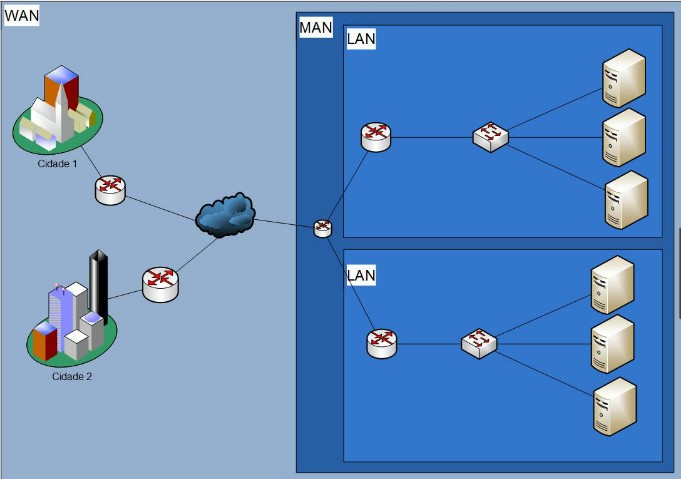

# Redes e computadores

Um resumo sobre redes e computadores

## História
-   Ano 1978: Criação de TCP/IP
- Ano 1983: Obrigatoriedade do TCP/IP

Segundo Soares, Lemos e Colcher(1995): "Uma rede de computadores se define por um conjunto de dispositivos capazes de efetuar qualquer tipo de troca de mensagens através de um meio de transmissão";

## Composição

- Intranet: Áreas, células e departamentos;
- Extranet: Parceiros, filiais e clientes;
- Internet: Público consumidor;

## Classificação

### Quanto à abrangência:
 São representados pelo número de dispositivos processadores, organizados em um tamanho físico.

- Lan (Local Area Network): Redes locais que cobrem uma área geograficamente limitada, como um escritório, uma escola ou um edifício. Normalmente, utilizam Ethernet ou Wi-Fi.

- CAN (Campus Area Network): Redes que conectam múltiplas LANs dentro de uma universidade, empresa ou campus industrial. Duas ou mais LAN's

- MAN (Metropolitan Area Network): Redes que cobrem uma cidade ou uma grande área urbana, conectando várias LANs dentro de uma região metropolitana. Usada por grandes corporações ou governos. Necessita de um ISP (internet service provider)

- WAN (Wide Area Network): Redes que cobrem grandes áreas geográficas, como países ou continentes. A internet é o maior exemplo de WAN. Global area network.

 - Explicação: 

### Quanto ao modelo computacional ou por serviço: 

- Centralizado : Processamento central com um computador de alta capacidade. Acesso por meio de terminais burros.

- Distribuída: Cada dispositivo possui sua capacidade de processamento. Exemplos: Cliente/Servidor, ponto-a-ponto, baseado em servidor e front-end/back-end.

- Cooperativa: Vários dispositivos
processadores para
completar uma
determinada tarefa.

### Quanto ao tipo de comutação:

- Circuito: Sempre o mesmo caminho, orientado à conexão e determinístico.

- Pacotes: Fragmentação, pacotes, datagramas, quadros, células, mensagens e de acordo com a camada.

### Quanto a topologia: 

Refere-se a maneira como os dispositivos processadores de uma rede estão conectados.

- Mesh (totalmente conectado): Totalmente redundante, mas com alto custo.

- Anel: Dispositivos interconectados, baixo custo de infra, mas se um dispositivo para, toda a rede para.

- Barramento: Elemento central, utiliza-se de um hub e usa cabeamento coaxial.

- Estrela: Usa um switch como concentrador e é usada em redes ethernet com cabeamento estruturado.

## Transmissão de dados

### Tipos

- Transmissão Simplex: Comunicação unidirecional onde os dados fluem em apenas uma direção.

- Transmissão Half-Duplex: Comunicação bidirecional, mas não simultânea. Os dados podem fluir em ambas as direções, mas apenas uma direção por vez. Ex: hub.

- Transmissão Full-Duplex: Comunicação bidirecional simultânea. Os dados podem fluir em ambas as direções ao mesmo tempo. Ex: switch.

### Analógica x Digital

No mundo real as informações são analógicas, podem assumir qualquer valor ao longo do tempo.

Os computadores sçao digitais por causa das interferências no sistema analógico, com valores de 0 e 1

### Correção de erros

Cada pacote transmitido na rede contém um código de verificação, checksum, que é a soma de todas as informações do pacote.

### Uso de canal

- Banda base: É usado apenas um canal e com sinal digital.

- Banda larga: É usado em multiplos canais e com sinal analógico.

### Medidas de desempenho

- Throughput: Taxa de transmissão prática da rede.

- Delay: tempo que o pacote demora para chegar ao destino.

- Atraso médio: soma do atraso de todos os pacotes dividido pelo número de pacotes.

- Jitter: desvio padrão referente ao atraso.

- RTT (Roud trip time): tempo de viagem ida e volta.