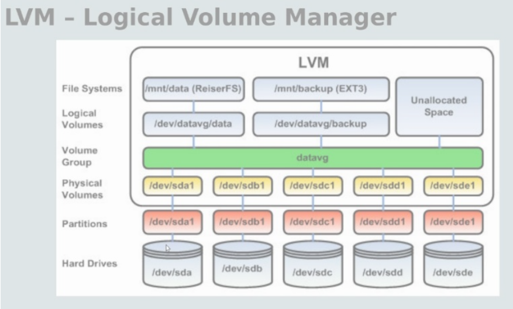

# Processos em Sistemas Operacionais  


## 🖥️ Introdução  
- Aborda conceitos essenciais como concorrência, paralelismo, processos, threads e programação síncrona/assíncrona.  
- Objetivo: simplificar e esclarecer a relação entre esses conceitos.  

---

## 🔄 Monotarefa vs Multitarefa  
- **Monotarefa**: Executa apenas um processo por vez, deixando recursos ociosos.  
- **Multitarefa**: Permite executar múltiplas tarefas simultaneamente, utilizando preempção para alternar entre processos.  

---

## ⚙️ Processos Sequenciais e Concorrentes  
- Um **processo** é um contêiner de recursos para execução de tarefas.  
- **Isolamento**: Processos não compartilham memória diretamente.  
- **Threads**: São "linhas" de execução dentro de um processo, compartilhando memória.  
- **Concorrência vs Paralelismo**:  
  - Concorrência → alternância entre tarefas (exemplo: fila de drive-thru).  
  - Paralelismo → execução simultânea em múltiplos núcleos de processador.  

---

## 🔄 Síncrono vs Assíncrono  
- **Síncrono**: Uma operação precisa ser concluída antes da próxima (exemplo: PHP).  
- **Assíncrono**: Várias operações alternam execução sem esperar (exemplo: GO).  

---

## 💾 Memória  
- **Primária (Volátil)**: RAM, Cache, Registradores → rápida, mas perde dados sem energia.  
- **Secundária (Não Volátil)**: SSD, HD → armazenamento permanente.  
- **Memória Virtual**: Utiliza SWAP quando a RAM está cheia.  

---

## ⚡ Processador  
- Evolução desde o Intel 4004 até os modernos Intel Core i7.  
- **Miniaturização** foi essencial para o avanço dos processadores.  

---

## 🖥️ Gestão do Sistema Operacional  
1. **Memory Manager** → Gerenciamento da Memória.  
2. **File Manager** → Gerenciamento de Arquivos.  
3. **Process Manager** → Gerenciamento de Processos.  
4. **Device Manager** → Gerenciamento de Dispositivos.  

---

## 🔄 Multiprogramação e Memória Virtual  
- **Multiprogramação em Memória Real**: Troca processos inteiros entre memória física e virtual.  
- **Multiprogramação com Memória Virtual**: Transferência de páginas ou segmentos.  
- **Multiplexação de Processos**: Simulação de execução simultânea no mesmo CPU.  

# 📌 Resumo do Documento: Sistemas de Arquivos Locais  

## 🗂️ Introdução  
- Os sistemas de arquivos são fundamentais nos sistemas operacionais.  
- Fornecem uma visão abstrata dos dados persistentes e organizam o acesso a arquivos.  

---

## 🖥️ Armazenamento e Requisitos  
- Aplicações precisam armazenar e recuperar dados além do espaço de endereçamento dos processos.  
- Três requisitos essenciais para armazenamento de longo prazo:  
  1. Capacidade para grandes volumes de dados.  
  2. Persistência dos dados mesmo após o término dos processos.  
  3. Acesso simultâneo por múltiplos processos.  

---

## 📂 Estrutura de Arquivos e Diretórios  
- **Arquivo**: Sequência de bytes com atributos como tamanho, permissões e dono.  
- **Diretório**: Mapeia nomes para identificadores de arquivos, podendo conter subdiretórios (estrutura em árvore).  
- O sistema de arquivos organiza e indexa os arquivos para acesso eficiente.  

---

## 🖱️ Acesso aos Arquivos  
- Pode ser feito via **interface gráfica** ou **linha de comando**.  
- Funções principais do sistema de arquivos:  
  - Gerenciamento de arquivos.  
  - Navegação na estrutura de diretórios.  
  - Recuperação e armazenamento de dados.  

---

## 🔧 Particionamento e Estruturas Internas  
- **Particionamento**: Divisão do disco em seções.  
- **Formatação**: Aplica um sistema de arquivos a uma partição.  
- Estruturas fundamentais:  
  - **MBR (Master Boot Record)**: Responsável pela inicialização do sistema.  
  - **Superbloco**: Contém informações essenciais do sistema de arquivos.  
  - **i-nodes**: Estruturas que armazenam metadados sobre arquivos.  

---

## 📜 Tipos de Sistemas de Arquivos  
### 🏷️ Alguns sistemas de arquivos e suas características:  

| Sistema de Arquivos | Descrição |
|---------------------|-----------|
| **BFS** | Utilizado no antigo BeOS, suporta indexação avançada. |
| **EFS** | Sistema de criptografia no NTFS para segurança de dados. |
| **ext** | Primeiro sistema de arquivos do Linux, substituído pelo ext2. |
| **ext3** | Extensão do ext2, com suporte a journaling. |
| **ext4** | Suporta volumes de até 1 Exbibyte e permite subdiretórios ilimitados. |
| **FAT** | Popular em sistemas antigos, possui versões como FAT12, FAT16 e FAT32. |
| **HFS+** | Desenvolvido pela Apple, utiliza estrutura B-tree. |
| **JFS** | Criado pela IBM, otimizado para multiprocessamento. |
| **NFS** | Sistema de arquivos distribuído para acesso remoto. |
| **NTFS** | Utilizado no Windows, suporta recuperação de arquivos. |
| **ReiserFS** | Projetado para Linux, otimizado para metadados. |
| **XFS** | Sistema de alto desempenho, com suporte a redimensionamento online. |
| **ZFS** | Integra gerenciamento de volumes e alta integridade de dados. |

---

## 📌 LVM (Logical Volume Manager)  
- Método de gerenciamento de discos que permite redimensionamento dinâmico.  
- Permite a combinação de múltiplos discos em volumes lógicos flexíveis.  
- **Vantagens**:  
  - Redimensionamento de partições.  
  - Uso eficiente de discos paralelos.  
  - Suporte a snapshots.  

  

# 📂 Guia Completo: Configuração e Expansão de LVM no Linux

## 🔹 O que é LVM?
O **LVM (Logical Volume Manager)** permite gerenciar discos e partições de forma flexível. Diferente do particionamento tradicional, ele possibilita **adicionar, remover e redimensionar volumes lógicos sem formatar ou perder dados**.

---

## 📌 Passo a Passo da Configuração do LVM

### 🟢 **1️⃣ Criar Partições para LVM**
Usamos o **fdisk** para criar uma partição do tipo `8e` (**Linux LVM**) nos discos `/dev/sdb` e `/dev/sdc`.

```bash
sudo fdisk /dev/sdb
```

* Pressione n para criar uma nova partição.
* Escolha p para partição primária.
* Aceite os valores padrão (usa todo o disco).
* Pressione t e digite 8e (Linux LVM).
* Pressione w para salvar.

### 🔄 Repita o mesmo processo para /dev/sdc.

 Verifique as partições criadas:

```bash
lsblk
sudo fdisk -l
```

---

## 🟢 2️⃣ Criar o Physical Volume (PV)

Agora que temos partições prontas, informamos ao LVM que elas serão usadas como armazenamento.

```bash
sudo pvcreate /dev/sdb /dev/sdc
```

🔍 Verifique os PVs criados:

```bash
sudo pvscan  # Lista os Physical Volumes disponíveis
sudo pvdisplay  # Exibe detalhes dos PVs
```

---

## 🟢 3️⃣ Criar o Volume Group (VG)

Agrupamos os Physical Volumes em um Volume Group (VG). Isso nos permite tratar vários discos como um único grande espaço de armazenamento.

```bash
sudo vgcreate vg_data /dev/sdb /dev/sdc
```

🔍 Verifique o VG criado:

```bash
sudo vgdisplay
```

---

## 🟢 4️⃣ Criar um Logical Volume (LV)

Dentro do Volume Group, criamos um Logical Volume (LV) para armazenar dados.

```bash
sudo lvcreate -L 2G -n lv_storage vg_data
```

🔍 Verifique o LV criado:

```bash
sudo lvdisplay
```

---

## 🟢 5️⃣ Formatar e Montar o LV

Agora, formatamos o Logical Volume com ext4 e o montamos.

```bash
sudo mkfs.ext4 /dev/vg_data/lv_storage  # Formata o LV
sudo mkdir /mnt/storage  # Cria um ponto de montagem
sudo mount /dev/vg_data/lv_storage /mnt/storage  # Monta o LV
```

Adicione ao /etc/fstab para montagem automática:

```bash
echo "/dev/vg_data/lv_storage /mnt/storage ext4 defaults 0 0" | sudo tee -a /etc/fstab
```

🔍 Verifique o espaço disponível:

```bash
df -h
```

---

## 📌 Expansão do Logical Volume (LV)

Agora, simulamos a adição de espaço ao volume lógico.

### 1️⃣ Verificar o Tamanho Atual

```bash
df -h
```

### 2️⃣ Expandir o LV

```bash
sudo lvextend -L +1G /dev/vg_data/lv_storage
```
🔹 Isso aumenta o LV em 1GB.

### 3️⃣ Redimensionar o Sistema de Arquivos

```bash
sudo resize2fs /dev/vg_data/lv_storage
```
🔹 Agora o sistema reconhece o espaço extra!

## 🎯 Resumo dos Passos
* 1️⃣ Criamos partições (fdisk - tipo 8e)
* 2️⃣ Transformamos as partições em Physical Volumes (pvcreate)
* 3️⃣ Agrupamos os PVs em um Volume Group (vgcreate)
* 4️⃣ Criamos um Logical Volume (lvcreate)
* 5️⃣ Formatamos, montamos e usamos o LV (mkfs.ext4, mount)
* 6️⃣ Expandimos o volume sem perder dados (lvextend, resize2fs)

---

## 🔄 SWAP (Memória Virtual)  
- Usado quando a RAM está cheia, armazenando dados temporários no disco.  
- Pode ser ativado e configurado no Linux via terminal.  

---

# 📂 Sistemas de Arquivos Distribuídos (SAD)

## 📝 Introdução
Os **Sistemas de Arquivos Distribuídos (SADs)** são projetados para permitir o acesso a arquivos armazenados em servidores remotos como se estivessem localmente disponíveis. Eles garantem que múltiplos usuários possam compartilhar arquivos de forma transparente, segura e eficiente, independente da localização física dos dados.

Quando bem projetado, um SAD oferece desempenho e confiabilidade similares a sistemas de arquivos locais, enquanto melhora a escalabilidade e a disponibilidade dos dados.

## 🔑 Características Principais
- **Compartilhamento de Arquivos:** Clientes remotos podem acessar arquivos armazenados em servidores distribuídos.
- **Estrutura Centralizada:** Mesmo com clientes dispersos, o gerenciamento de arquivos é unificado.
- **Escalabilidade:** Capacidade de aumentar a quantidade de nós (servidores e clientes) sem comprometer o desempenho.
- **Tolerância a Falhas:** Se um servidor falhar, o sistema deve continuar funcionando sem perda de dados.
- **Segurança:** Controle de acesso e autenticação de usuários.

---

## ❓ Por Que Utilizar um SAD?
Os SADs surgiram para resolver problemas de armazenamento e compartilhamento de arquivos em redes distribuídas. Algumas vantagens incluem:
- **Economia de Espaço:** Não é necessário armazenar arquivos localmente em todas as máquinas.
- **Gerenciamento Centralizado:** Facilita backups e administração dos dados.
- **Acesso Remoto:** Possibilidade de acessar arquivos a partir de diferentes dispositivos e locais.
- **Balanceamento de Carga:** Distribuição eficiente de arquivos entre servidores.

---

## ⚙️ Funcionalidades de um SAD
Os SADs fornecem uma interface para manipulação de arquivos, incluindo:
- **Abertura e fechamento de arquivos**
- **Leitura e escrita de dados**
- **Listagem e busca de arquivos**
- **Bloqueio de arquivos ou partes deles**
- **Exclusão e renomeação de arquivos e diretórios**

Além disso, um SAD pode implementar **caching** para melhorar o desempenho e reduzir a latência.

---

## 📌 Requisitos de um SAD
Um SAD deve oferecer:
1. **Compartilhamento Transparente:** Usuários devem acessar arquivos sem se preocupar com sua localização física.
2. **Mobilidade do Usuário:** Permite que o usuário trabalhe de diferentes máquinas sem perder o acesso aos seus arquivos.
3. **Replicação de Arquivos:** Copiar arquivos em múltiplos servidores para aumentar confiabilidade e desempenho.
4. **Consistência:** Todas as cópias de um arquivo devem permanecer sincronizadas.
5. **Eficiência e Escalabilidade:** Capacidade de suportar grandes volumes de dados e usuários simultâneos.

---

## 🏛️ Arquitetura de um SAD
Os SADs geralmente seguem o modelo **Cliente-Servidor**, onde:
- **Cliente:** Solicita operações de arquivos (ler, gravar, modificar, excluir).
- **Servidor:** Processa solicitações e gerencia os arquivos armazenados.

Existem diferentes formas de armazenamento:
- **Centralizado:** Todos os arquivos são mantidos em um único servidor.
- **Distribuído:** Arquivos são distribuídos entre múltiplos servidores.

Outros modelos incluem SADs baseados em **Cluster**, onde múltiplos servidores trabalham em conjunto para aumentar a performance e confiabilidade.

---

## 🔧 Serviços de um SAD
Os SADs oferecem serviços essenciais, incluindo:
1. **Serviço de Nomes Distribuído:** Localiza arquivos pelo nome ou caminho.
2. **Serviço de Arquivos Distribuído:** Garante operações como leitura, escrita e controle de acesso.
3. **Serviço de Diretórios Distribuído:** Organiza arquivos em uma estrutura hierárquica de diretórios e subdiretórios.

---

## 📌 Exemplos de SADs
Existem diversas implementações de SADs, algumas bastante populares:
- **NFS (Network File System):** Usado em sistemas Unix/Linux, permite acesso remoto a arquivos via RPC.
- **GFS (Google File System):** Desenvolvido para armazenar grandes volumes de dados do Google.
- **GlusterFS:** Um sistema de arquivos escalável baseado em blocos distribuídos.
- **PVFS (Parallel Virtual File System):** Usado para computação de alto desempenho.
- **HDFS (Hadoop Distributed File System):** Projetado para Big Data e processamento paralelo.
- **Ceph:** Sistema distribuído usado para armazenamento em nuvem.
- **Lustre:** Comum em supercomputação.
- **CODA:** Focado em disponibilidade constante de dados.
- **DFS (Distributed File System):** Implementação da Microsoft.

---

## 📊 Desafios e Melhorias em SADs
Embora os SADs tragam muitos benefícios, também apresentam desafios:
- **Latência de Rede:** O tempo de resposta pode ser maior que em sistemas locais.
- **Consistência:** Manter todas as cópias de um arquivo sincronizadas pode ser complexo.
- **Gerenciamento de Conflitos:** Quando múltiplos usuários editam o mesmo arquivo simultaneamente.
- **Segurança:** Proteção contra acessos não autorizados e falhas de autenticação.

### 🔹 Melhorias possíveis:
- Implementação de **cache local** para acelerar o acesso aos arquivos.
- Uso de **algoritmos eficientes de replicação** para garantir a consistência dos dados.
- Aplicação de **técnicas de compressão e compactação** para otimizar a transmissão de arquivos na rede.

---

## 📌 Conclusão
Os **Sistemas de Arquivos Distribuídos (SADs)** são essenciais para a computação moderna, garantindo armazenamento eficiente, compartilhamento de arquivos e escalabilidade para grandes redes e infraestruturas de TI. Eles são amplamente utilizados em ambientes corporativos, nuvem, Big Data e supercomputação.

O avanço das tecnologias de armazenamento distribuído, junto com melhorias em segurança e desempenho, tornam os SADs cada vez mais robustos e adaptáveis às necessidades modernas.

---

# Resumo: Padrão ANSI/TIA-942 para Data Centers

## O que é a norma TIA-942?
A **TIA-942** é um padrão que define os requisitos mínimos para a infraestrutura de um **Data Center (DC)**, abrangendo:

- **HVAC** (Aquecimento, Ventilação e Ar-condicionado)
- **Energia e iluminação**
- **Arquitetura e piso elevado**
- **Redundância e controle de acesso**
- **Prevenção de incêndios**
- **Cabeamento estruturado**

## Principais Referências
A norma TIA-942 faz referência a diversos outros padrões como:

- ANSI/TIA/EIA-568 (Cabeamento de telecomunicações)
- ANSI/NFPA 70 (Código elétrico nacional)
- ASHRAE (Diretrizes térmicas para ambientes de processamento de dados)

## Topologia Básica de um Data Center
Elementos do cabeamento de um **Data Center**:

1. **Cabeamento horizontal**
2. **Backbone**
3. **Conexões cruzadas (MC, HC)**
4. **Áreas de distribuição (MDA, HDA, SDA, ZDA, EDA)**

## Espaços Definidos na TIA-942
- **Sala de Entrada (EF)**: Interface com operadoras de telecom.
- **Sala de Telecom (TR)**: Suporte para cabeamento externo à sala de computadores.
- **Área de Distribuição Principal (MDA)**: Cross-connect principal, aloca switches core.
- **Área de Distribuição Horizontal (HDA)**: Conexão entre ativos e equipamentos.
- **Área de Equipamentos (EDA)**: Hospeda servidores e storages.

## Classificação dos Data Centers (Tiers)
A norma divide os Data Centers em **4 níveis (Tiers)**:

### **Tier I - Básico**
- Sem redundância, único caminho de distribuição.
- Falha em qualquer componente pode interromper operações.
- Até **28.8 horas de downtime anuais** permitidas.

### **Tier II - Componentes Redundantes**
- Redundância mínima (N+1) para UPS e refrigeração.
- Dois caminhos de entrada para telecomunicações.
- Até **22.0 horas de downtime anuais** permitidas.

### **Tier III - Sistema Auto Sustentado**
- Atendido por pelo menos **duas operadoras de telecom**.
- Duas **Salas de Entrada (ER)** separadas fisicamente.
- Permite manutenção sem interrupção.
- **1.6 horas de downtime anuais** permitidas.

### **Tier IV - Sem Tolerância a Falhas**
- **Redundância total (2N+1)** para energia e refrigeração.
- Backbone de cabeamento protegido por dutos fechados.
- Utilização de duas fontes de energia separadas.
- **0.4 horas de downtime anuais** permitidas.

## Requisitos de Infraestrutura
- **Controle ambiental:** Temperatura de **18°C a 27°C**, umidade entre **40% e 55%**.
- **Piso elevado:** Alturas variam conforme Tier (30cm a 91cm).
- **Iluminação:** Mínimo de **500 lux** no plano horizontal.
- **Energia:** Redundância UPS e geradores, tomadas independentes para serviços.

## Resfriamento e Cabeamento
- **Corredores quentes e frios** para otimização do fluxo de ar.
- **Cabeamento LSZH** para melhor resistência ao fogo e menor emissão de fumaça.

## Conclusão
O padrão **TIA-942** estabelece diretrizes essenciais para garantir a **eficiência, segurança e disponibilidade** de Data Centers, sendo a classificação **Tier** um fator crucial na escolha do nível de infraestrutura adequado para cada necessidade.
